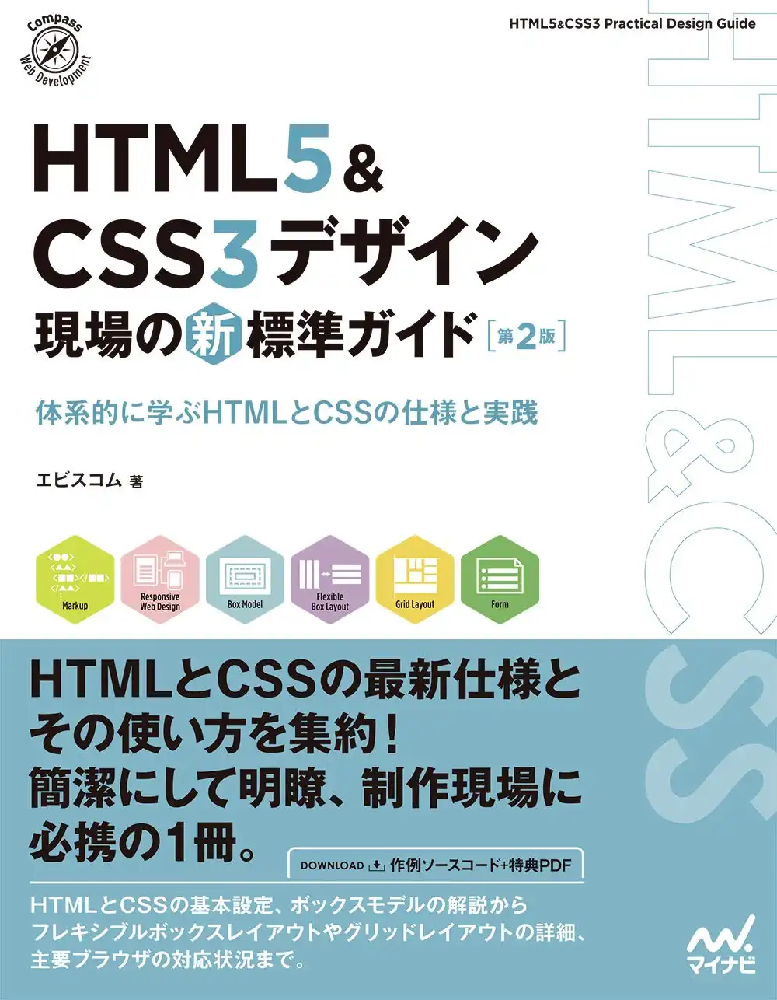
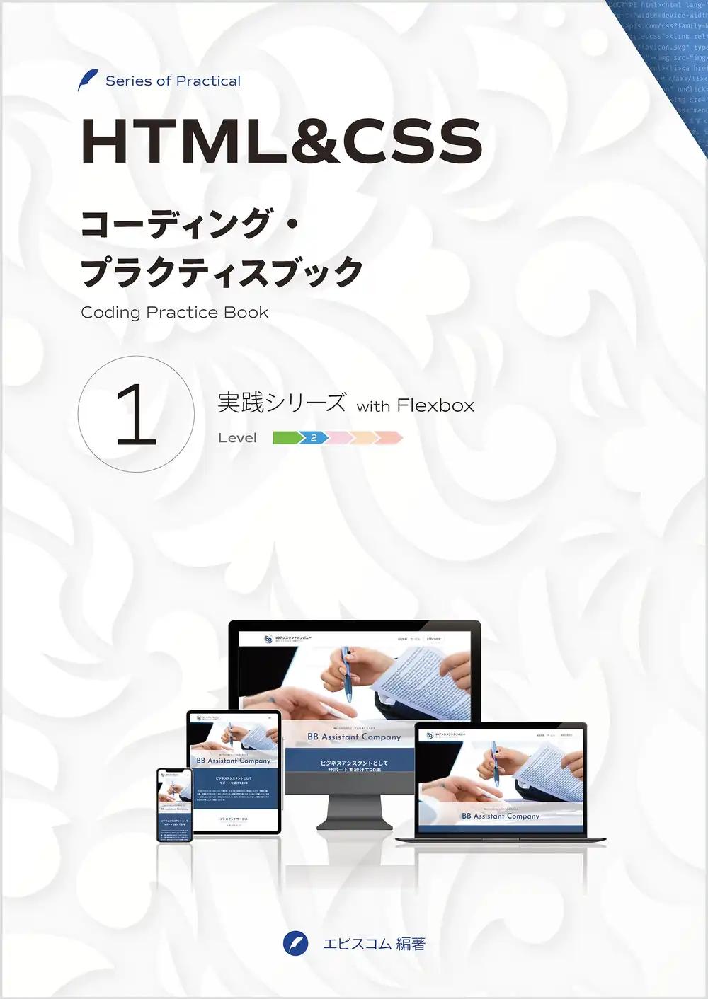
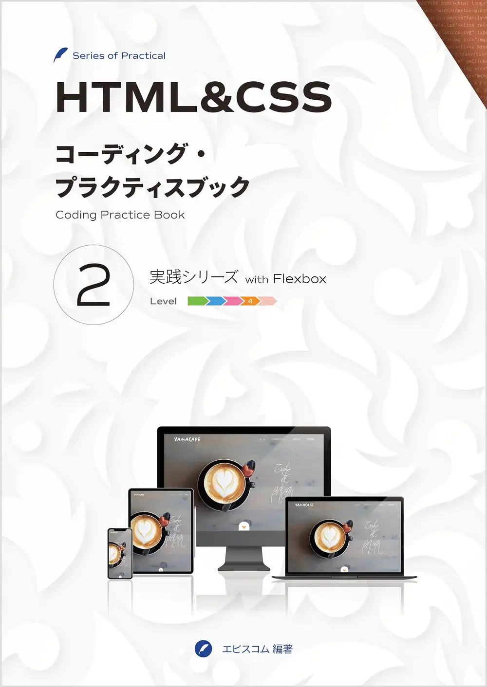
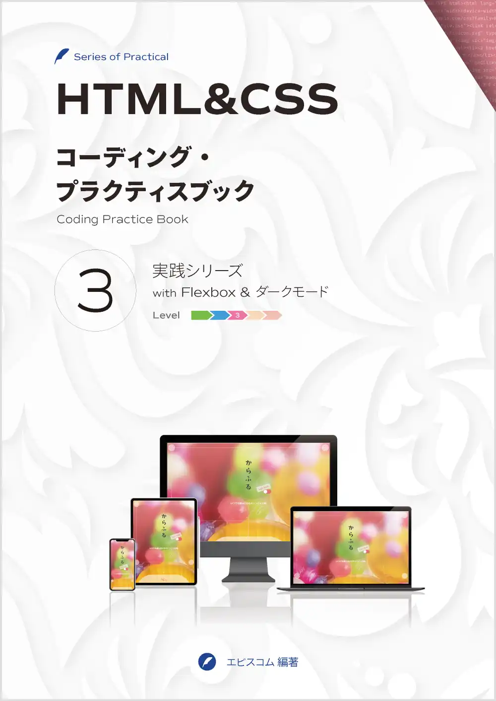
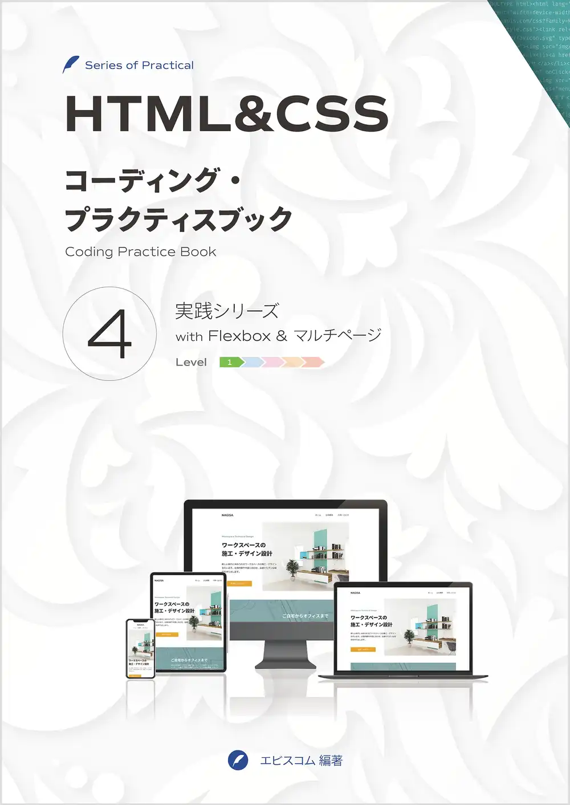
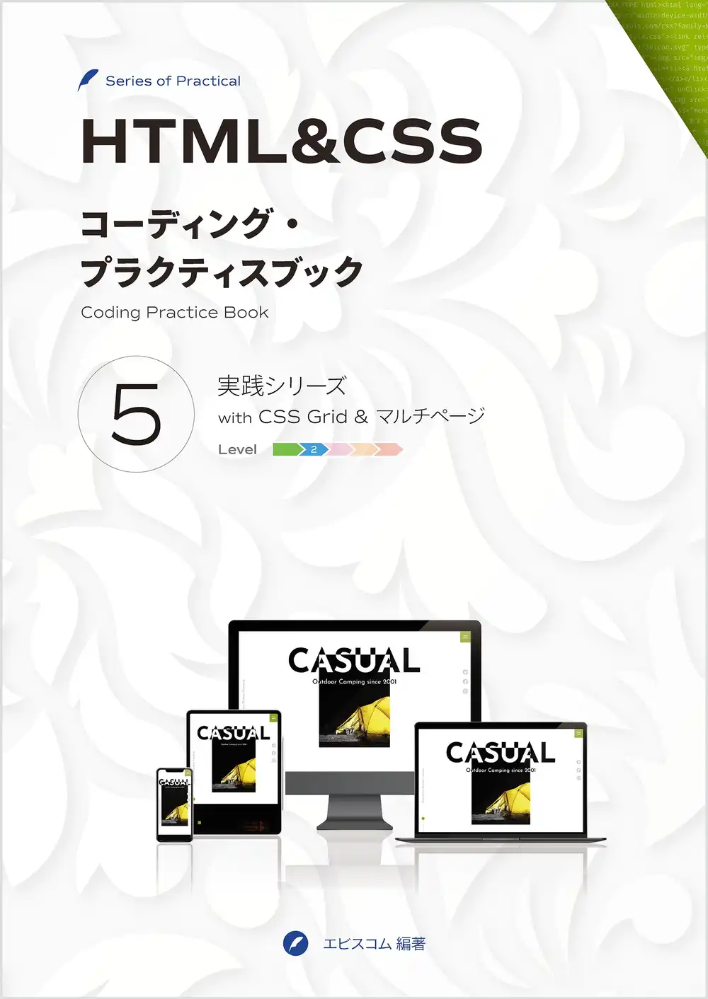
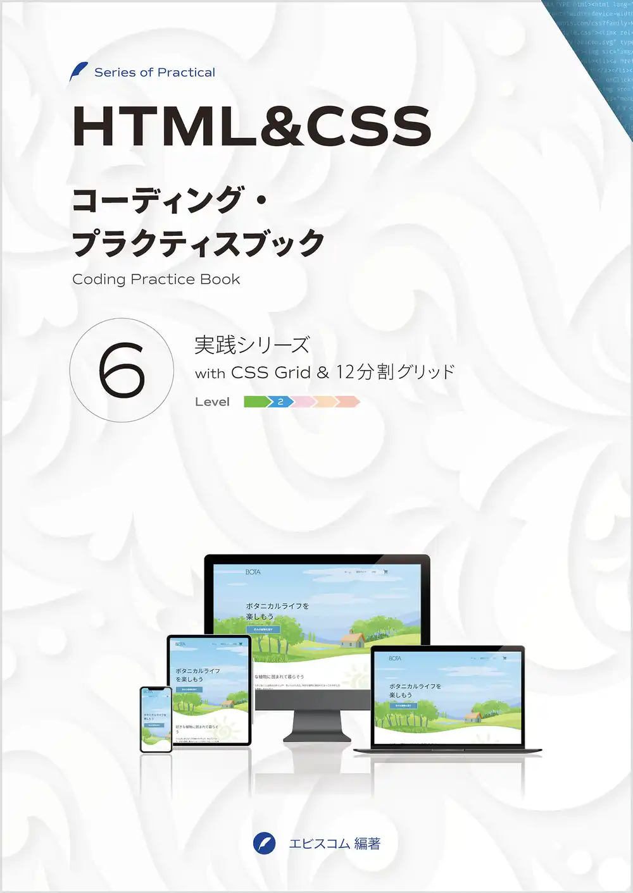

# Learning-Styling

HTML/CSS/SCSS/pug/webpackを使ってスタイリングを学ぶ

## 参考資料

|Book|
|:---:|
|[HTML5&CSS3デザイン](https://ebisu.com/html5-css3-practical-design-guide-2/)|
||

|eBook|eBook|eBook|
|:---:|:---:|:---:|
[コーディングプラクティス1](https://ep.ebisu.com/practice01/)|[コーディングプラクティス2](https://ep.ebisu.com/practice02/)|[コーディングプラクティス3](https://ep.ebisu.com/practice03/)|
||||
|Level 2|Level 4|Level 3|

|eBook|eBook|eBook|
|:---:|:---:|:---:|
[コーディングプラクティス4](https://ep.ebisu.com/practice04/)|[コーディングプラクティス5](https://ep.ebisu.com/practice05/)|[コーディングプラクティス6](https://ep.ebisu.com/practice06/)|
||||
|Level 1|Level 2|Level 2|

## 目標

- Pug/Sassの学習
  - Pug/Sassを使い、テキストをもとにHTML/CSSファイルを作成

- Gatsbyの利用
  - 作成したHTML/CSSファイルをGatsby CloudにデプロイできるようにGatsbyを使って作り直す

