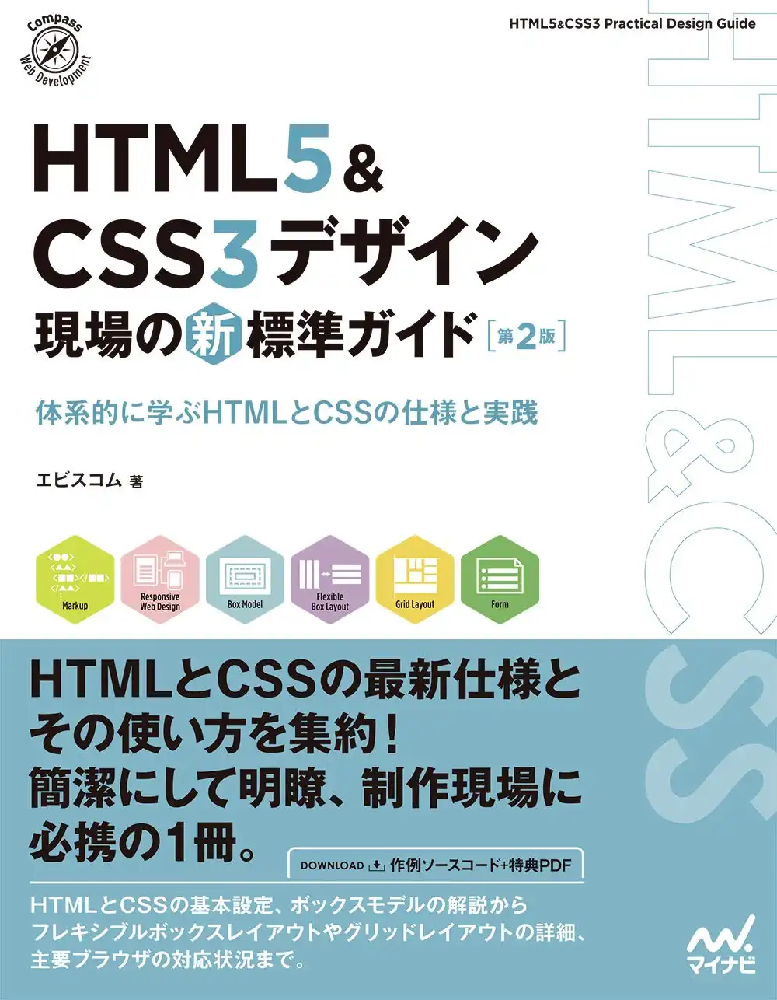
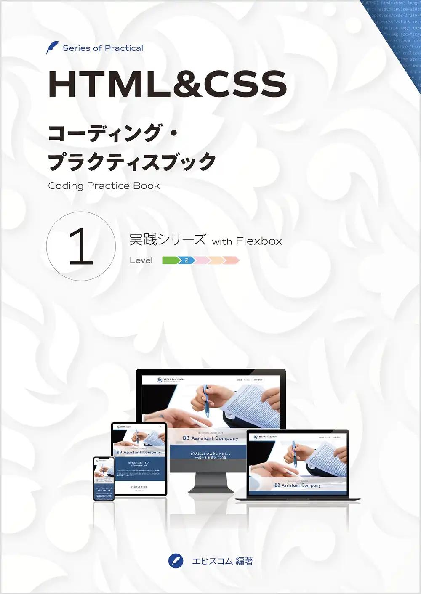
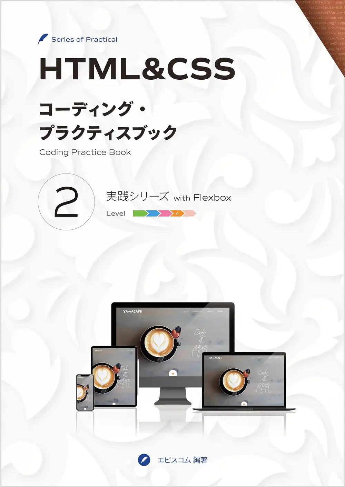
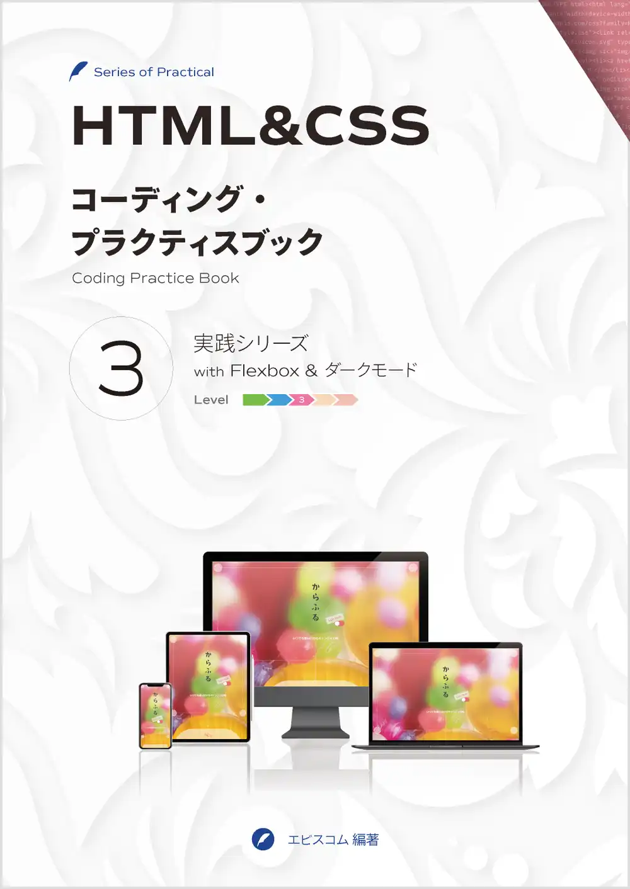
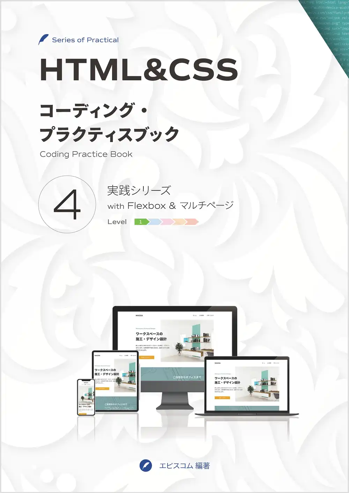
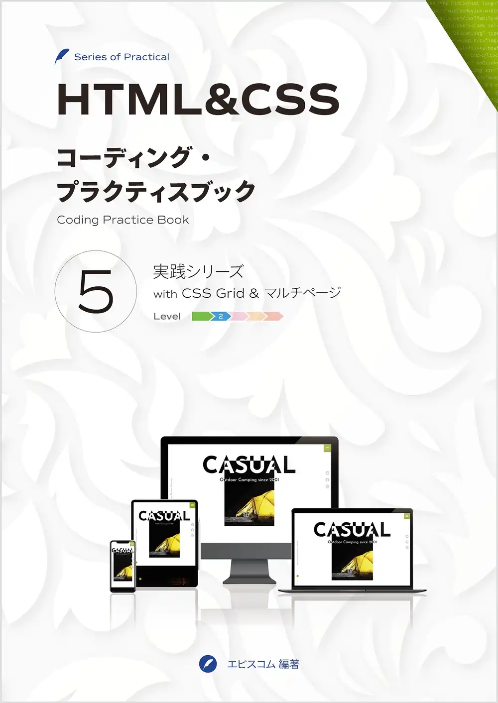
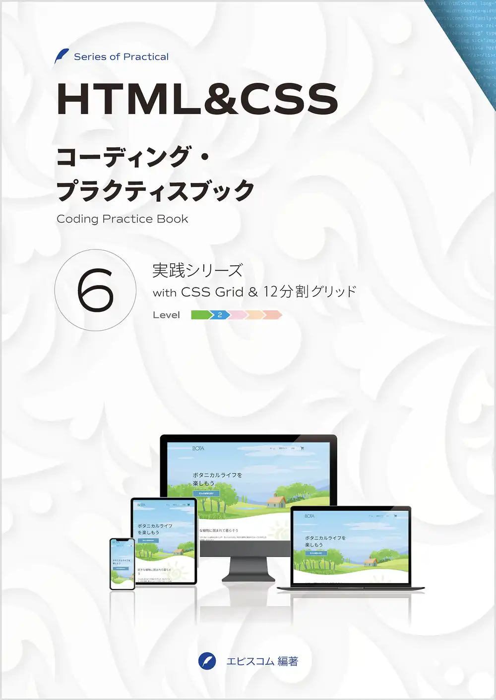

# learning-styling

HTML/CSS/SCSS/Pug/webpackを使ってスタイリングを学ぶ

## 参考

|Image|Title|
|---|---|
||[HTML5&CSS3デザイン](https://ebisu.com/html5-css3-practical-design-guide-2/)|
||[コーディングプラクティス1](https://ep.ebisu.com/practice01/)|
||[コーディングプラクティス2](https://ep.ebisu.com/practice02/)|
||[コーディングプラクティス3](https://ep.ebisu.com/practice03/)|
||[コーディングプラクティス4](https://ep.ebisu.com/practice04/)|
||[コーディングプラクティス5](https://ep.ebisu.com/practice05/)|
||[コーディングプラクティス6](https://ep.ebisu.com/practice06/)|
